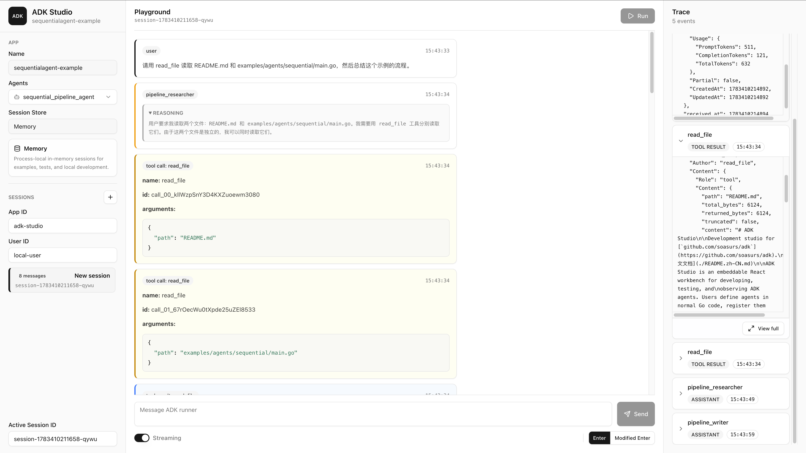

# ADK Studio

Development studio for [`github.com/soasurs/adk`](https://github.com/soasurs/adk).

[中文文档](./README.zh-CN.md)

ADK Studio is an embeddable React workbench for developing, testing, and
observing ADK agents. Users define agents in normal Go code, register them with
Studio, and serve the Studio UI from the same process. Studio does not
dynamically load arbitrary Go source.

## UI Preview



## Architecture

This repository is split into three parts:

- root Go package `studio`: embeddable Studio app, HTTP handler, and static UI
  serving.
- `frontend`: React + Vite frontend. No Next.js.
- `examples`: runnable examples that show how a user project hosts Studio.

The intended runtime boundary is:

```text
React Studio UI
        ↓ same HTTP server
studio.NewHandler(app)
        ↓
github.com/soasurs/adk Runner + Agent + Tools + Session
```

`frontend/dist` is generated build output and is intentionally ignored by Git.
Run the frontend build before compiling Go code that embeds the UI.

## Current Scope

This is still a small Studio skeleton, but the main loop is functional:

- register one or more ADK agents in a `studio.App`.
- provide a session service for multi-turn runs.
- discover registered agents through `/api/agents`.
- run the selected agent through `POST /api/runs`.
- inspect ADK events and runtime span records in the trace panel.
- display assistant messages, reasoning content, tool calls, and tool results
  as separate UI entries.
- optionally stream live ADK events over SSE when the Studio UI runs an agent.
- use a fixed-height React workbench with sidebar controls, playground, trace
  inspector, and configurable send shortcut.

The run API keeps the completed JSON response for ordinary clients. Clients that
send `Accept: text/event-stream` receive live SSE frames as ADK events and
runtime span records are produced. Both transports preserve the shared runtime
feed order.

## Build

Install and build the frontend first:

```bash
cd frontend
pnpm install
pnpm build
cd ..
```

Then build or test the Go package:

```bash
go test ./...
go build ./...
```

The Go package embeds `frontend/dist` with `go:embed`, so a fresh checkout needs
the frontend build before `go test`, `go build`, or `go run` can compile the
handler.

## Run Examples

Each example focuses on one ADK Studio dimension. All examples listen on
`:18080` by default. Set `STUDIO_ADDR` to use another address.

Agent examples use DeepSeek and require:

```bash
export DEEPSEEK_API_KEY=...
# Optional:
export DEEPSEEK_MODEL=...
```

Run one agent type at a time:

```bash
go run ./examples/agents/llm
go run ./examples/agents/sequential
go run ./examples/agents/parallel
```

- `examples/agents/llm`: registers one DeepSeek-backed `llmagent` with local
  fixture tools. Try: `帮我检查 Alex 的订单，看看为什么发货延迟，并给一个处理建议。`
- `examples/agents/sequential`: registers one `sequentialagent` that runs a
  researcher sub-agent with `read_file`, then a writer sub-agent. Try:
  `请用 read_file 读取 README.md 和 examples/agents/sequential/main.go，然后总结这个示例的流程。`
- `examples/agents/parallel`: registers one `parallelagent` that fans out to
  two reviewers and merges their answers. Try:
  `请评估：把所有 session 都放在内存里是否适合生产环境？`

Session backend examples use a deterministic echo agent so the session store is
the only variable:

```bash
go run ./examples/sessions/memory
go run ./examples/sessions/sqlite
ADK_STUDIO_POSTGRES_DSN=postgres://... go run ./examples/sessions/postgres
```

- `examples/sessions/memory`: uses `session/memory`.
- `examples/sessions/sqlite`: uses ADK `session/database` with SQLite. Set
  `ADK_STUDIO_SQLITE_DSN` to override the default local database file.
- `examples/sessions/postgres`: uses ADK `session/database` with PostgreSQL.
  Multi-process deployments should also provide a distributed run locker.

Open [http://127.0.0.1:18080](http://127.0.0.1:18080) after starting an
example.

## Frontend Development

Run any Go example on `:18080`, then start Vite:

```bash
cd frontend
pnpm dev
```

The Vite dev server proxies `/api/*` requests to
`http://127.0.0.1:18080`.

Production assets are generated with:

```bash
cd frontend
pnpm build
```

Generated files under `frontend/dist` should not be committed.

## Embedding Studio

Integration in a user project should look like this:

```go
package main

import (
    "context"
    "log"

    studio "github.com/soasurs/adk-studio"
    "github.com/soasurs/adk/session/memory"
)

func main() {
    ctx := context.Background()

    app := studio.NewApp(studio.AppConfig{
        Name:     "demo",
        LogLevel: studio.LogLevelInfo,
    })
    app.MustRegisterAgent(myAgent)
    if err := app.UseSessionService(memory.NewMemorySessionService()); err != nil {
        log.Fatal(err)
    }

    if err := studio.Serve(ctx, app, ":18080"); err != nil {
        log.Fatal(err)
    }
}
```

For more control, mount the handler yourself:

```go
http.ListenAndServe(":18080", studio.NewHandler(app))
```

Studio logs to `stderr` with Go's `log/slog` text handler at INFO level by
default. Every ADK event returned by a run is logged at INFO. Use
`LogLevelDebug`, `LogLevelWarn`, `LogLevelError`, or `LogLevelOff`, or pass a
custom `*slog.Logger` in `AppConfig.Logger` when embedding Studio.

Studio always collects ADK runtime spans for the trace panel. To fan the same
spans out to host observability, configure an ADK `trace.Tracer`; Studio
preserves the context returned by that tracer for downstream spans:

```go
app := studio.NewApp(studio.AppConfig{
    Name:   "demo",
    Tracer: hostTracer,
})
```

Leaving `Tracer` nil only disables host-side forwarding; it does not add span
logs or disable the Studio UI collector.

## HTTP APIs

- `GET /api/health`: handler health and start time.
- `GET /api/app`: app name, agent count, session-service status, and current
  session backend summary.
- `GET /api/agents`: registered agent summaries.
- `GET /api/agents/{agent_id}`: one registered agent summary.
- `POST /api/runs`: run a registered agent with an input `model.Content`.

Minimal run request:

```json
{
  "agent_id": "llm_agent",
  "app_name": "llmagent-example",
  "user_id": "local-user",
  "session_id": "session-1",
  "input": {
    "role": "user",
    "content": "Hi"
  }
}
```

By default the response includes a Studio `run_id`, the active `session_id`, and
the ordered run feed. Send `Accept: text/event-stream` to receive `trace`,
`event`, `partial`, `error`, and `done` SSE frames as the run progresses.
Completed JSON responses contain the same runtime trace records and terminal
frame, but omit partial model events.

`trace` frames use a stable snake-case record with span `phase` (`start`,
`event`, or `end`), `kind`, timestamp, duration, ADK runtime run/turn/session
identifiers, and relevant agent, model, tool, event, token, and error fields.
Tool spans retain `tool_index: 0`. ADK `model.Event` payloads also expose
`TurnID` and full token usage details.

Terminal responses keep the existing top-level `error` string and HTTP 500
behavior. The final `error` frame additionally carries a typed `failure` such
as `run_failed` or `tool_execution_unknown`. Unknown-tool-execution details
identify the source turn/event and unresolved call IDs/names, but never include
tool arguments. Runtime and source event IDs use decimal strings so JavaScript
clients preserve the full 64-bit Snowflake value.

ADK v0.0.10 rolls back every persisted event from an incomplete turn. Studio
cancels and waits for the runner when an SSE client disconnects or a write
fails, so that rollback completes before the handler returns. In the UI, a
failed turn keeps the locally entered user message marked `Failed · not
persisted`, removes assistant/tool messages from that Studio run, and retains
the complete attempt, terminal failure, and spans in Trace. Studio never retries
`tool_execution_unknown` calls automatically; start a new session or repair the
persisted history before using that session again.
